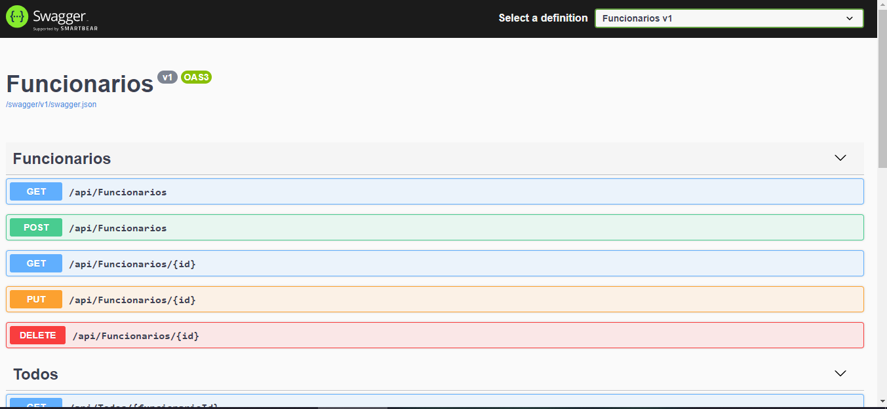
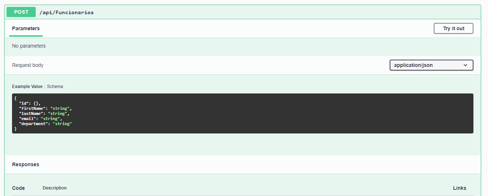
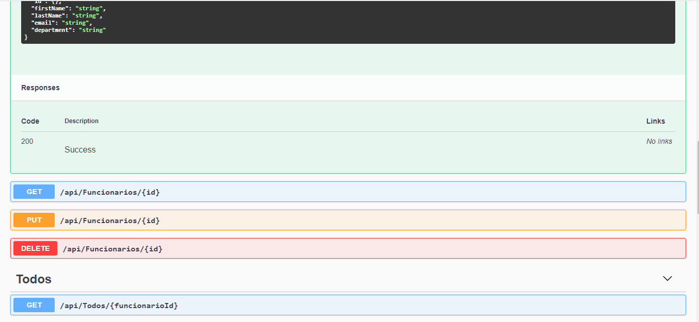

# Funcionarios-API
Projeto Web API com metodos https, realizado com DotNet 6.0 preview, swagger e Banco MongoDB.

# Dependencias utilizadas
- AutoMapper.Extensions.Microsoft.DependencyInjection
- Microsoft.VisualStudio.Web.CodeGeneration.Design
- MongoDB.Driver
- Swashbuckle.AspNetCore
- Swashbuckle.AspNetCore.Annotations
- Swashbuckle.AspNetCore.Filters
- Swagger
